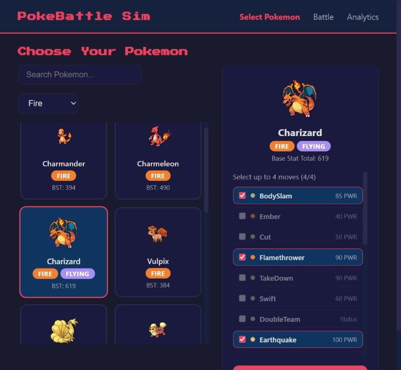
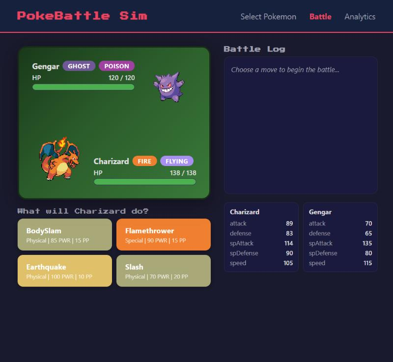
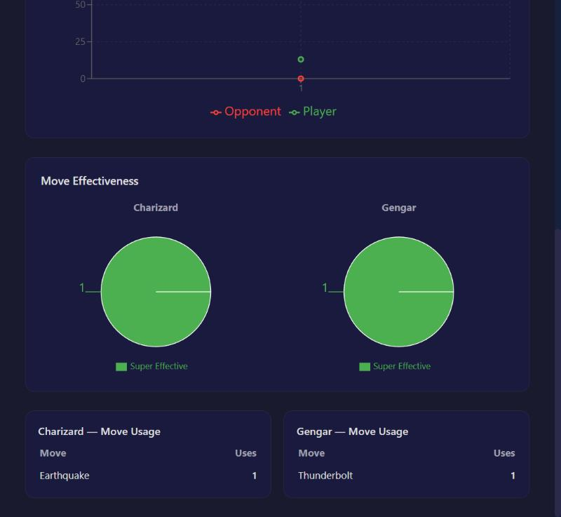

# PokeBattle Sim

A Gen 1 Pokemon battle simulator with an AI opponent, animated battles, and post-battle analytics. Built w/ React + TypeScript frontend and FastAPI (Python) backend.

Originally created to keep track of my progress with learning Typescript and React.

Features:
- All Gen 1 Pokemon with info scraped from Bulbapedia
- AI opponent that selects a stat-matched Pokemon, and chooses moves w/ a weighted scoring system (damage potential, status value, healing prio, and context bonuses)
- Accurate Gen 1 damage formula
- Status effects
- Battle animations (might be buggy though) w/ CSS keyframes
- Battle Analytics with interactive charts, using Recharts
- Dark theme, obviously

  

## Tech Stack
 
- Frontend: React 19, TypeScript, Vite
- Styling: CSS custom properties, keyframes
- Charts: Recharts
- Routing: React Router v7
- HTTP: Axios
- Backend: FastAPI, Pydantic
- Testing: Pytest, httpx
- Data: CSV (pokemon.csv, moves.csv)

## Getting Started

### Prerequisites

- **Python 3.10+**
- **Node.js 18+** and npm

### Backend Setup

>cd backend
>pip install -r requirements.txt
>python -m uvicorn app.main:app --port 8000

The API will be available at `http://localhost:8000`, you can view the auto-gen docs at `http://localhost:8000/docs`

### Frontend Setup

>cd frontend
>npm install
>npm run dev

The app will be available at `http://localhost:5173`

### Running Tests

>cd backend
>python -m pytest tests/ -v

## API References

GET    | `/api/pokemon`                  | List all Pokemon   
GET    | `/api/pokemon/{id}`             | Pokemon detail + stats  
GET    | `/api/pokemon/{id}/moves`       | Available moves for a Pokemon
POST   | `/api/battle/start`             | Start a new battle      
POST   | `/api/battle/move`              | Execute a turn          
GET    | `/api/battle/{id}/analytics`    | Get battle analytics    

## AI Opponent Logic

The AI uses a weighted scoring system rather than random selection:

- Damage Score (0-100): Estimates damage output considering type effectiveness and STAB
- Status Score (0-40): Values status moves (burn, paralyze, stat boosts) when conditions are favorable
- Healing Score (0-35): Prioritizes healing when HP is low
- Context Bonuses: Extra weight for finishing moves when opponent HP is low
- Noise (&plusmn;5): Small random factor to prevent perfectly predictable play

## Changes from Original Application

The original codebase had 6 bugs that were identified and fixed:

- Wrong variable reference for Delayed status (used attacker instead of defender)
- Speed comparison typo (`lower` instead of `slower`)
- Wrong `max_health` reference for burn/poison damage calculation
- Incorrect dict deletion for Freeze thaw (deleted from `effects` instead of `start_status`)
- Permanent moveset mutation across battles (missing deep copy)
- Double random factor in damage calculation (applied twice instead of once)

## TO-DO

- More animations!
- Add Pokemon from ALL generations. Currently, there's only Gen 1 Pokemon
- Allow user to combine Pokemon-types when searching
